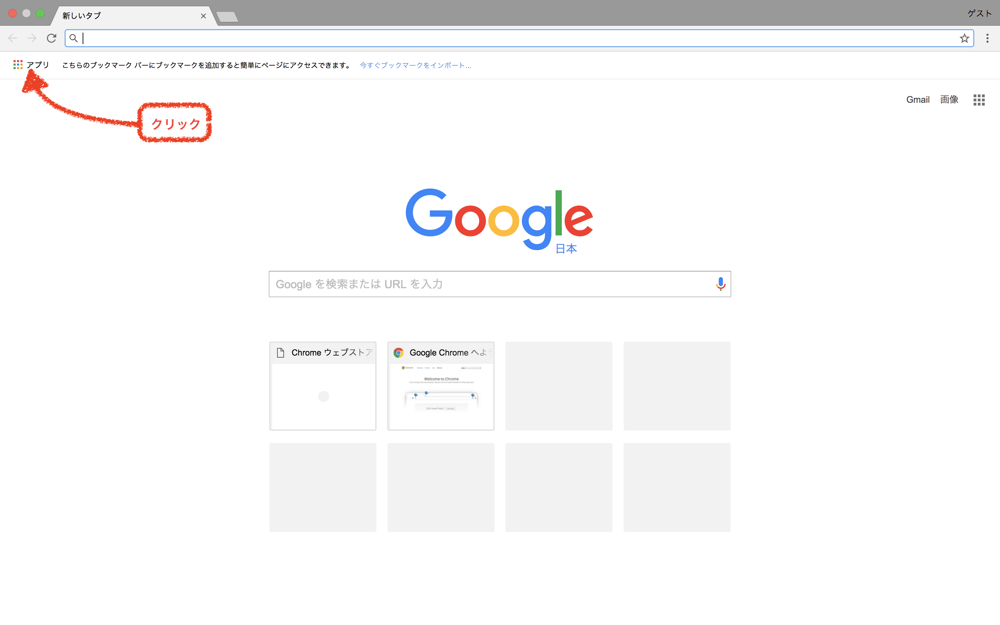
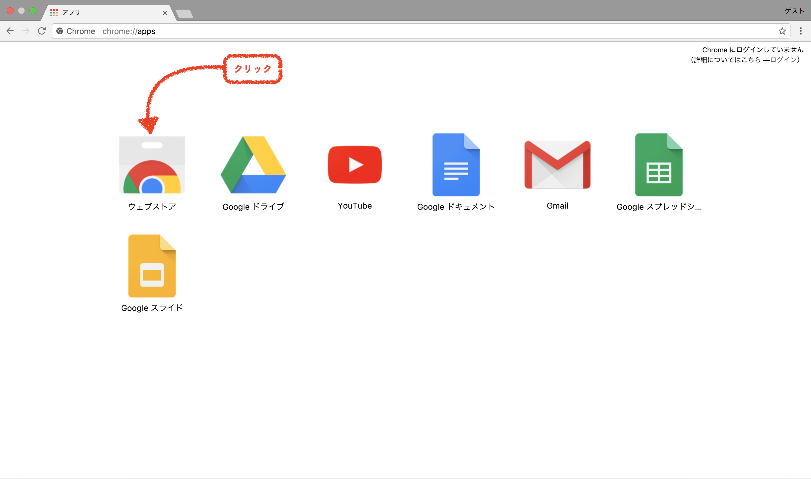
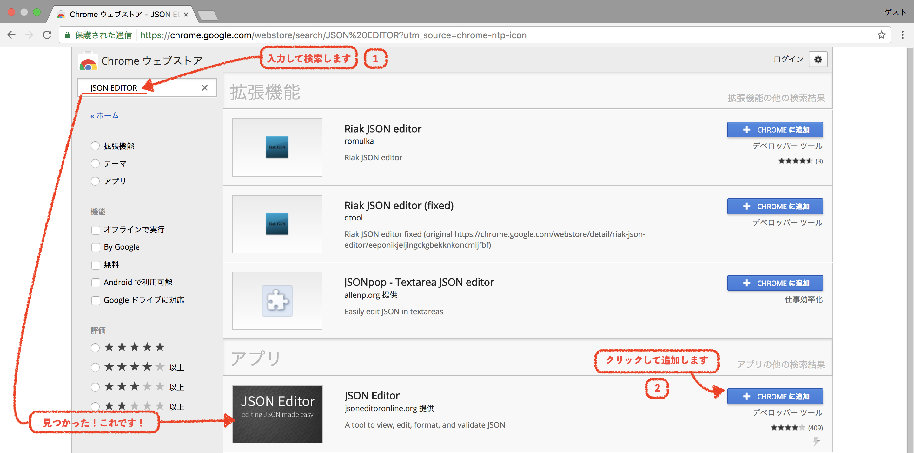
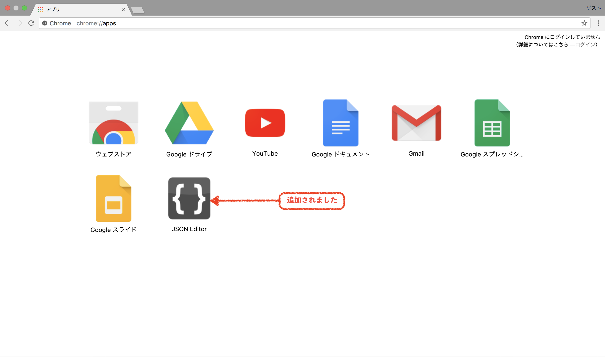
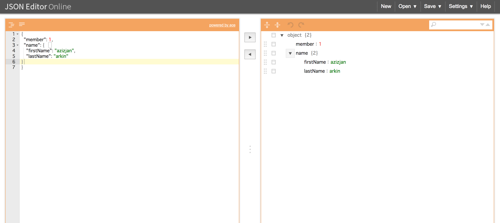
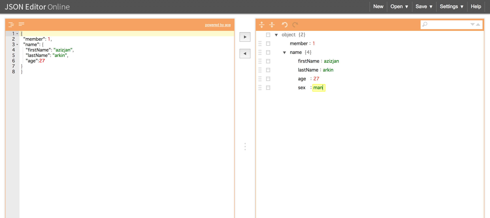
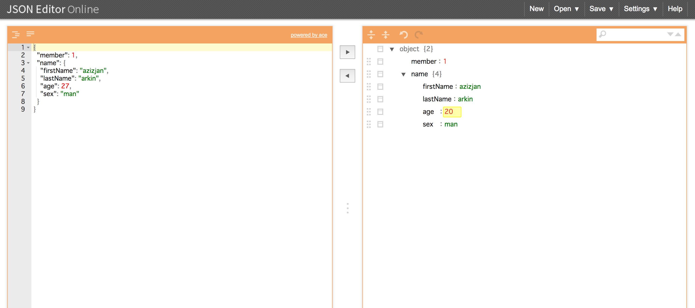
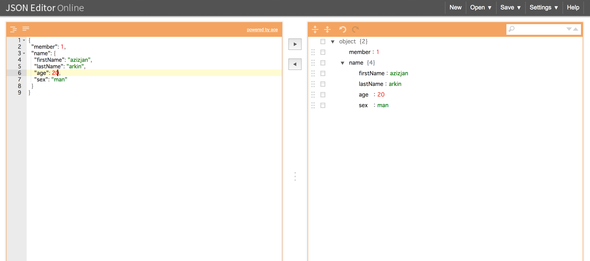
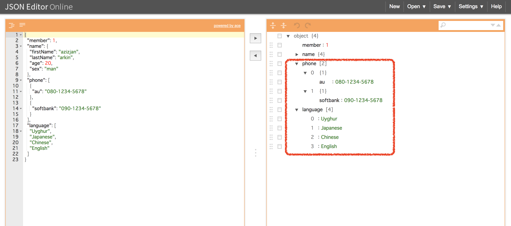
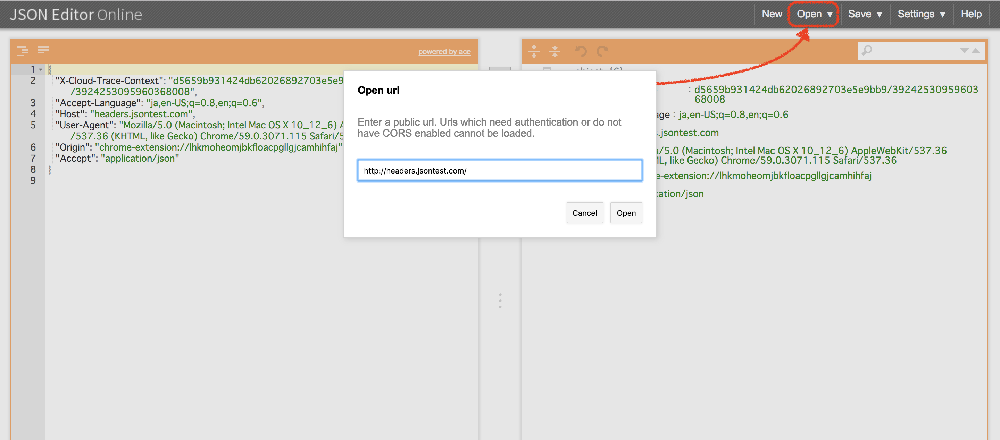

<!-- $theme: gaia -->
<!-- page_number: true -->
<!-- $size: 17:6 -->

みなさんこんにちは、新卒社員のJANです。研修期間内に学んだJSON及びJavaScriptでの扱いかたについてまとめて説明します。

# 目次

1.[JSONとは](#JSON)<br>
2.[XMLと比較](#XMLANDJSON)<br>
3.[JSONを使う理由](#WhyusetheJSON)<br>
4.[JSONの記法](#NotationofJSON)<br>
5.[JSONで利用可能なデータ](#JSONdata)<br>
6.[JavaScriptでのJSONの扱い方](#JSONinJavaScript)<br>
    6.1. [JSON.parse(text[,reviver])](#parse)<br>
    6.2. [JSON.stringify(value[,replacer[,space]])](#stringify)<br>
7.[JSONエディタ](#JSONparse)<br>
    7.1. [機能拡張の追加](#Addfunctionextension)<br>
    7.2. [使い方のご説明](#Explanationofusage)<br>
8.[参考URL](#reference)<br>

<a id="JSON"></a>
# 1.JSONとは

JSON(JavaScript Object Notation)は軽量で人間に読みやすいデータフォーマットの一種です。
JSONはJavaScriptで簡単に扱えるため、AjaxによるWebアプリケーション開発で使われることが多いですが、JavaScript以外のプログラム言語でも利用できます。同じ目的で使われるフォーマットにXMLもありますが、XMLと比べると簡潔に構造化されたデータを記述することができます。

<a id="XMLANDJSON"></a>
# 2.XMLと比較

 + XMLとの類似点
   - テキストベースのデータフォーマット
   - JavaScriptによって解析できる
   - データはAjaxによってやりとりできる
   - データ交換形式

<a id="WhyusetheJSON"></a>
# 3.JSONを使う理由
最近ではJSON形式で返すWeb APIが多く利用されています。JSONはそのシンプルな仕様により、人間が読みやすく、またプログラム的にもJSONの生成やパースを行うライブラリが非常に書きやすいです。JSONを用いることによって、非常に単純な方法でデータを表現し転送することが可能です。

<a id="NotationofJSON"></a>
# 4.JSONの記法

オブジェクト全体は(`{ }`)波かっこで囲み、キーと値は(`:`)コロンで区切って記述します。キーは(`" "`)ダブルクォーテーションで括った文字列のみ使用可能です。

* 例　→　`{"name":"jan"}`

(`,`)カンマで複数のキーと値を分けて記述します。

* 例　→　`{"name":"jan","age":27}`

配列は繰り返し項目を表現するときに使います。(`[　]`)角かっこで囲み、値を(`,`)カンマで区切って記述します。

* 例　→　`{"languages":["Uyghur","Chinese","Japanese","English"]}`

<a id="JSONdata"></a>
# 5.JSONで利用可能なデータ

JSONでは使用できる６種類の「値」があります。
* 数字(number, <font color="Tomato">`8進数と16進数を除く`</font>)
* 文字列(string)
* 真偽値(true,false)
* 配列(array)
* オブジェクト(object)
* null

<a id="JSONinJavaScript"></a>
# 6.JavaScriptでのJSONの扱い方

 __JavaScriptは標準でJSONをパースしたりシリアライズするためのAPIを持っているためJSONとの親和性が非常に高いです。__

<a id="parse"></a>
### 6.1. `JSON.parse(text[,reviver])`<br>
`JSON.parse()`メソッドはJSON文字列を解析してJavaScriptのオブジェクトに変換してくれます。<br>
* text(必須)<br>
`text`は有効なJSON文字列です。<br>
`JSON.parse()`メソッドにJSON文字列のみを指定した場合次のようになります。

```JavaScript:member.js
let obj = '{"firstName": "Jan","lastName": "Arkin","phone": ["111-1111-1111", "000-0000-0000"]}'
console.log(JSON.parse(obj));

結果　=> 

Object
    firstName:"Jan"
    lastName:"Arkin"
        phone:Array(2)
            0:"111-1111-1111"
            1:"000-0000-0000"
            length:2
```
* reviver<br>
省略可能ですが、メソッドを指定した場合次のようになります。

```JavaScript:member.js
let obj = '{"firstName": "Jan","lastName": "Arkin","phone": ["111-1111-1111", "000-0000-0000"]}'

function change(key, value) {
    if (key === "firstName") { 
        return "Azizjan";
    }
    return value;
 }

console.log(JSON.parse(obj, change));

結果  =>

Object
    firstName:"Azizjan"
    lastName:"Arkin"
        phone:Array(2)
            0:"111-1111-1111"
            1:"000-0000-0000"
            length:2
```
* reviverに渡したメソッドがundefinedを返した場合、指定したプロパティは結果の文字列から削除されます。

```
let obj = '{"firstName": "Jan","lastName": "Arkin","phone": ["111-1111-1111", "000-0000-0000"]}'

function change(key, value) {
    if (key === "firstName") { 
        return undefined;
    }
    return value;
 }

console.log(JSON.parse(obj, change));

結果  =>

Object
    lastName:"Arkin"
        phone:Array(2)
            0:"111-1111-1111"
            1:"000-0000-0000"
            length:2

```


---
<a id="stringify"></a>
### 6.2. `JSON.stringify(value[,replacer[,space]])`<br>
JavaScriptの値をJSON文字列に変換してくれます。<br>

* value(必須)<br>
`value`は変換されるJavaScriptの値です。<br>
`JSON.stringify()`メソッドに変換されるJavaScriptの値のみを指定した場合次のようになります。

```JavaScript:member.js
let obj = {
    firstName: "Jan",
    lastName: "Arkin",
    phone: ["111-1111-1111", "000-0000-0000"]
};
console.log(JSON.stringify(obj));

結果　=> 

{"firstName":"Jan","lastName":"Arkin","phone":["111-1111-1111","000-0000-0000"]}
```

* replacer<br>
`JSON.parse()`で説明したのと同じです。

```JavaScript:member.js
let obj = {
    firstName: "Jan",
    lastName: "Arkin",
    phone: ["111-1111-1111", "000-0000-0000"]
};

function change(key, value) {
    if (key === "firstName") { 
        return "Azizjan";
    }
    return value;
 }

 console.log(JSON.stringify(obj, change, "\t"));

結果  => 

{
	"firstName": "Azizjan",
	"lastName": "Arkin",
	"phone": [
		"111-1111-1111",
		"000-0000-0000"
	]
}
```

* replacerに渡したメソッドがundefinedを返した場合、指定したプロパティは結果のオブジェクトから削除されます。

```JavaScript:member.js
let obj = {
    firstName: "Jan",
    lastName: "Arkin",
    phone: ["111-1111-1111", "000-0000-0000"]
};
console.log(JSON.stringify(obj, change, "\t"));

function change(key, value) {
    if (key === "firstName") { 
        return undefined;
    }
    return value;
 }

 結果 => 
 
 {
	"lastName": "Arkin",
	"phone": [
		"111-1111-1111",
		"000-0000-0000"
	]
}
```

* space<br>
__出力するJSON文字列に可読性を目的に空白を挿入してみやすく整形してくれます。__<br>
省略可能です。<br>
`String`または`Number`で指定できます。`Number`の時は挿入したい空白の数を示します。この数字は1~10まで設定できますが、1より小さい時に空白使わないことを示し、10より大きい時には10と同じとなります。`String`の場合は、その指定した文字が10文字超えた時に最初の10文字が空白として使われます。`null`かまたは何も指定していない時は空白なしで生成されます。`\t`タブを使うことによって標準的な整形をしてくれます。

1. 省略した場合次のようになります。

```JavaScript:member.js
console.log(JSON.stringify({firstName:"Jan",lastName:"Arkin",age:27},null));

結果  => 

{"firstName":"Jan","lastName":"Arkin","age":27}

```

2. インデント空白を5文字で指定した場合、次のようになります。

```JavaScript:member.js
console.log(JSON.stringify({firstName:"Jan",lastName:"Arkin",age:27},null,5));

結果  => 


{
     "firstName": "Jan",
     "lastName": "Arkin",
     "age": 27
}
```

3. インデント空白を10文字で指定した場合、次のようになります。

```JavaScript:member.js
console.log(JSON.stringify({firstName:"Jan",lastName:"Arkin",age:27},null,10));

結果  =>


{
          "firstName": "Jan",
          "lastName": "Arkin",
          "age": 27
}
```

4. インデント空白が10文字を超えた場合でも上記3番目の10と同じような結果になります。

```JavaScript:member.js
console.log(JSON.stringify({firstName:"Jan",lastName:"Arkin",age:27},null,20));

結果  =>


{
          "firstName": "Jan",
          "lastName": "Arkin",
          "age": 27
}

```

5. `String`文字を指定した場合に次のようになります。

```JavaScript:member.js
console.log(JSON.stringify({firstName:"Jan",lastName:"Arkin",age:27},null,'aaaaaaaaaaaa'));

結果  =>

{
aaaaaaaaaa"firstName": "Jan",
aaaaaaaaaa"lastName": "Arkin",
aaaaaaaaaa"age": 27
}

```

6. `\t`を指定した場合に次のようになります。

```JavaScript:member.js
console.log(JSON.stringify({firstName:"Jan",lastName:"Arkin",age:27},null,'\t'));

結果  =>

{
	"firstName": "Jan",
	"lastName": "Arkin",
	"age": 27
}

```


* toJSONとは

toJSONメソッドはJSON.stringifyメソッド内で呼び出され、JavaScript値をJSONテキストにシリアル化します。変換されるオブジェクトがtoJSONという名前のプロパティを持ち、その値がメソッドである場合、toJSONメソッドは本来のシリアライズ処理の代わりにJSON変換処理をカスタマイズし、変換された値をtoJSONメソッドで返します。


```JavaScript:member.js
console.log(JSON.stringify({
    firstName: "Jan",lastName:"Arkin",age:27, toJSON: function () { 
        return "yaxa";
},},null,'\t'));

結果  =>

"yaxa"

```


JSONを扱うにはもう一つの方法としてJavaScript組み込みの`eval()`メソッドを使う手段があります。引数で指定されたJSON文字列をJavaScriptプログラムの一部(オブジェクト)へ変換できます。
ただし、`eval()`メソッドではJavaScript任意のコードを実行可能なため、悪意のあるJSONデータの場合はセキュリティー上の問題になってしまう可能性があるので、<font color="Tomato">__オススメしません。__</font>


<a id="JSONparse"></a>
 # 7.JSONエディタ

構造がわかりづらかったり、自分で手作業でJSONファイルを作成したりするといった時に便利なのが[JSON Editor](#Explanationofusage)です。

GoogleChromeウェブストア拡張機能を利用すればとても便利です。
<a id="Addfunctionextension"></a>
## 7.1. 機能拡張の追加
1.
2.
3.
4.

<a id="Explanationofusage"></a>
## 7.2. 使い方のご説明
1.左側がJSONテキストフォーマットで、右側が綺麗に見やすく解析してくれた結果のツリービューです。


2.項目を追加して、中央にある左右に矢印ボタンをクリックすると反映されます。


3.左側でツリーを使って値を変更したりキーを追加したりできます。


4.その結果を逆に戻すこともできます。


5.配列も表現されます。


6.URLを指定してJSONの取得もできます。


<a id="reference"></a>
# 8.参考URL
[1]JSONIntroducing,JSONIntroducing,(最終閲覧日：2017年7月24日)<br>
[http://www.json.org/]<br>
[2]q∂~∂p@qoAop,JSON.stringifyを改めて調べる,(最終閲覧日：2017年7月24日)<br>
[http://qiita.com/qoAop/items/57d35a41ef9629351c3c]<br>
[3]moongift,Webブラウザ、Google ChromeでJSON構造の確認、編集「JSON Editor Online」,(最終閲覧日：2017年7月20日)<br>[http://www.moongift.jp/2012/12/web%E3%83%96%E3%83%A9%E3%82%A6%E3%82%B6%E3%80%81google-chrome%E3%81%A7json%E6%A7%8B%E9%80%A0%E3%81%AE%E7%A2%BA%E8%AA%8D%E3%80%81%E7%B7%A8%E9%9B%86%E3%80%8Cjson-editor-online%E3%80%8D/]<br>
[4]岩谷 和男,第6回・JSONファイル｜CSV、XML、JSON…データフォーマットの変遷について考える,(最終閲覧日：2017年7月20日)<br>
[https://www.gixo.jp/blog/4196/]<br>
[5]竹添 直樹,JSONってなにもの？,(最終閲覧日：2017年7月19日)<br>
[https://thinkit.co.jp/article/70/1]<br>
[6]都元ダイスケ,非エンジニアに贈る「具体例でさらっと学ぶJSON」,(最終閲覧日：2017年7月19日)<br>
[http://dev.classmethod.jp/etc/concrete-example-of-json/]<br>